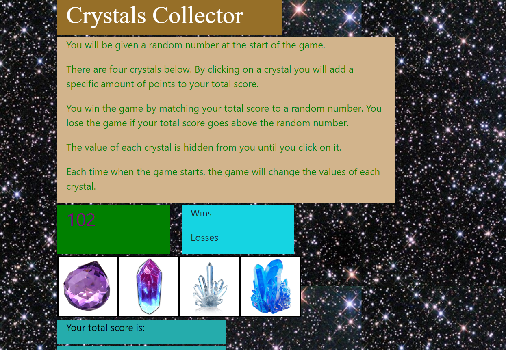

# Crystal Collector

## Overview

This App  dynamically updates your HTML pages with the jQuery library.

## Game Description

* There are four crystals displayed as buttons on the page.

* The player will be shown a random number at the start of the game.

* When the player clicks on a crystal, it will add a specific amount of points to the player's total score. 

* The player wins if their total score matches the random number from the beginning of the game.

* The player loses if their score goes above the random number.